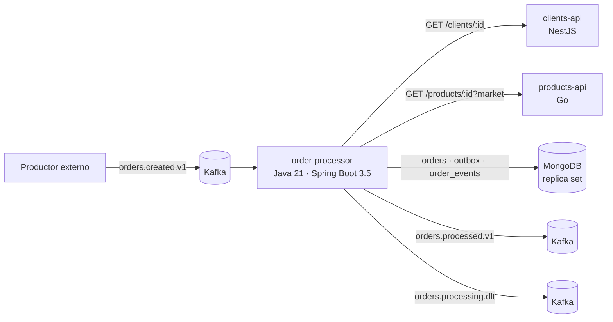

# Plataforma confiable de pedidos B2B

Procesamiento de pedidos de distribuidores de MX, CO y PE. Un pedido llega a Kafka, se valida, se enriquece con datos de clientes y productos, se calculan impuestos y descuentos, se guarda en MongoDB y el resultado se publica en otro tópico. Duplicados, concurrencia y fallos parciales se manejan de forma explícita.



| Componente | Tecnología | Responsabilidad |
|---|---|---|
| [`order-processor`](order-processor/README.md) | Java 21, Spring Boot 3.5, virtual threads | Reglas de negocio, idempotencia, consistencia MongoDB ↔ Kafka, DLT |
| [`products-api`](products-api/README.md) | Go 1.22, librería estándar | Catálogo de productos por mercado |
| [`clients-api`](clients-api/README.md) | NestJS 11, TypeScript estricto | Datos de clientes |
| [`contracts`](contracts/README.md) | JSON Schema, OpenAPI | Contratos de eventos y APIs, con ejemplos que usan los tests de los tres servicios |
| [`infra`](infra/README.md) | Docker Compose | Kafka (KRaft), MongoDB (replica set), tópicos, índices y scripts de prueba |

## Requisitos

| Para | Necesitas |
|---|---|
| Ejecutar todo | Docker Desktop con Docker Compose v2 |
| Scripts de `infra/scripts` en Windows | Git Bash (o WSL) |
| Tests de order-processor | JDK 21 (Maven se descarga solo con `mvnw`) y Docker para los tests de integración |
| Tests de products-api | Go 1.22 o superior |
| Tests de clients-api y de contratos | Node.js 22 |

No se necesitan credenciales ni servicios externos: las APIs usan datos semilla en memoria.

## Ejecución

```bash
cp .env.example .env              # opcional: todos los valores tienen un valor por defecto
docker compose up -d --build
docker compose ps                 # products-api, clients-api y order-processor deben quedar "healthy"
```

La primera vez tarda unos minutos porque compila las tres imágenes.

| Servicio | URL local |
|---|---|
| products-api | http://localhost:8081/health |
| clients-api | http://localhost:8082/health |
| order-processor | http://localhost:8083/actuator/health |
| Métricas de order-processor | http://localhost:8083/actuator/prometheus |
| Kafka UI (opcional) | `docker compose --profile tools up -d kafka-ui` → http://localhost:8080 |

Para apagar: `docker compose down` (con `-v` también borra los datos).

### Problemas frecuentes al levantar

| Síntoma | Causa | Solución |
|---|---|---|
| `ports are not available ... bind: Intento de acceso a un socket no permitido` (en inglés, *An attempt was made to access a socket in a way forbidden*) | En Windows, Hyper-V/WSL2 reserva rangos de puertos al arrancar; el puerto no lo usa otro programa, está reservado | Ver los rangos con `netsh interface ipv4 show excludedportrange protocol=tcp`, cambiar el puerto afectado en `.env` (p. ej. `ORDER_PROCESSOR_PORT=18083`) y ejecutar `docker compose up -d` |
| `port is already allocated` | Otro programa usa el puerto | Cambiar el puerto en `.env` |
| `Cannot connect to the Docker daemon` | Docker Desktop no está abierto | Abrirlo y esperar a *Engine running* |
| `kafka-init` o `mongo-init` terminan con código distinto de 0 | Scripts con fin de línea de Windows | Clonar de nuevo: `.gitattributes` fuerza LF (se comprueba con `git ls-files --eol infra/kafka/create-topics.sh`) |
| Resultados inesperados por pruebas anteriores | Datos viejos en MongoDB o Kafka | `docker compose down -v` y volver a levantar |

Si cambias un puerto en `.env`, usa ese puerto en las URLs de esta guía.

## Pruebas

```bash
cd order-processor && ./mvnw test      # unitarios (sin Docker)
cd order-processor && ./mvnw verify    # + integración con Testcontainers (requiere Docker)
cd products-api && go vet ./... && go test ./...
cd clients-api && npm ci && npm run typecheck && npm test
cd contracts && npm ci && npm run validate
```

En PowerShell, `.\mvnw.cmd` en lugar de `./mvnw`. Los mismos comandos corren en CI (`.github/workflows/ci.yml`).

Qué cubren los tests de order-processor, además de las reglas de negocio:

| Situación | Test |
|---|---|
| Cálculo por mercado y categoría, exención, descuento, redondeo y totales | `domain/pricing/*`, `OrderEvaluatorTest` |
| Validaciones y casos límite del contrato de entrada | `OrderValidatorTest`, `OrderEventParserTest` (con los fixtures de `/contracts`) |
| El mismo evento en 8 hilos a la vez: 1 documento y 1 mensaje | `MongoStoresIT` |
| Dos eventos distintos con la misma versión: un solo ganador | `MongoStoresIT` |
| Una versión anterior que llega tarde no sobrescribe | `MongoStoresIT`, `OrderProcessingIT` |
| 404, 429, 5xx, timeout, reintentos, respuesta fuera de contrato | `HttpCatalogsIT`, `HttpRetrierTest` |
| Flujo completo: aprobado, rechazado, inválido, dependencia caída | `OrderProcessingIT` |

## Probar el flujo a mano

Con el sistema levantado y desde la raíz, en Git Bash:

```bash
# 1. Publicar el pedido de ejemplo del enunciado
infra/scripts/publish-event.sh contracts/events/examples/orders.created.v1/valid/mx-wholesale-golden.json

# 2. Ver el evento de salida (status APPROVED, grandTotal 2100.11)
infra/scripts/consume-topic.sh orders.processed.v1

# 3. Ver el pedido en MongoDB
infra/scripts/mongo-shell.sh 'printjson(db.orders.findOne({_id: "ORD-MX-000147"}))'
```

Otros escenarios:

```bash
# Duplicado: el mismo evento 3 veces → un solo resultado y deliveries: 3
infra/scripts/publish-event.sh contracts/events/examples/orders.created.v1/valid/mx-wholesale-golden.json orders.created.v1 3
infra/scripts/mongo-shell.sh 'printjson(db.order_events.find({orderId: "ORD-MX-000147"}).toArray())'

# Rechazo de negocio: cliente bloqueado en PE
infra/scripts/publish-event.sh contracts/events/examples/orders.created.v1/valid/pe-blocked-client.json

# Evento inválido: va a orders.processing.dlt con sus headers y no se guarda como pedido
infra/scripts/publish-event.sh contracts/events/examples/orders.created.v1/invalid-semantic/currency-market-mismatch.json
infra/scripts/consume-topic.sh orders.processing.dlt

# Revisión 2 del mismo pedido: reemplaza el resultado de la revisión 1
infra/scripts/publish-event.sh contracts/events/examples/orders.created.v1/valid/mx-golden-revision-2.json
```

### Simular fallos

Las APIs incluyen inyección de fallos, activa en Docker Compose (`FAULT_INJECTION_ENABLED=true`):

| Cómo | Efecto |
|---|---|
| Producto `PRD-FAIL-503`, `PRD-FAIL-429`, `PRD-FAIL-TIMEOUT`, `PRD-FAIL-400` | products-api responde siempre ese error para ese id |
| Cliente `CLI-FAIL-503`, `CLI-FAIL-429`, `CLI-FAIL-TIMEOUT`, `CLI-FAIL-400` | Igual en clients-api |
| Header `X-Fault: 503` (o `429`, `500`, `502`, `timeout`) | Fallo en una llamada manual con curl |
| `docker compose stop mongo` | order-processor deja de confirmar offsets y reintenta con backoff; al volver MongoDB, continúa sin perder pedidos |
| `docker compose stop kafka` durante el procesamiento | El resultado queda en el outbox y se publica cuando Kafka vuelve |

Un pedido con un producto que siempre falla termina en `TECHNICAL_FAILURE` y en la DLT después de 3 intentos:

```bash
sed -e 's/PRD-008/PRD-FAIL-503/' -e 's/ORD-MX-000147/ORD-MX-FAIL-1/' -e 's/01J8ZP6M5E4RH0K7Y2N9A3TQWX/01J8ZP6M5E4RH0K7Y2N9A3TQX0/' \
  contracts/events/examples/orders.created.v1/valid/mx-wholesale-golden.json > /tmp/fail.json
infra/scripts/publish-event.sh /tmp/fail.json
infra/scripts/mongo-shell.sh 'printjson(db.orders.findOne({_id: "ORD-MX-FAIL-1"}, {status: 1, error: 1}))'
```

## Configuración

Variables de `.env` (todas opcionales):

| Variable | Por defecto | Uso |
|---|---|---|
| `KAFKA_VERSION`, `MONGO_VERSION`, `KAFKA_UI_VERSION` | `4.0.0`, `8.0`, `v1.2.0` | Versiones de imágenes |
| `KAFKA_HOST_PORT`, `MONGO_HOST_PORT` | `9092`, `27017` | Puertos en tu máquina |
| `PRODUCTS_API_PORT`, `CLIENTS_API_PORT`, `ORDER_PROCESSOR_PORT`, `KAFKA_UI_PORT` | `8081`, `8082`, `8083`, `8080` | Puertos en tu máquina |
| `MONGO_DB` | `orders` | Base de datos de order-processor |
| `TOPIC_PARTITIONS` | `3` | Particiones de los tópicos y consumidores de order-processor |
| `FAULT_INJECTION_ENABLED` | `true` | Inyección de fallos en las APIs |
| `LOG_LEVEL` | `info` | Nivel de log de las APIs |
| `ORDER_PROCESSOR_LOG_FORMAT` | `logstash` | Logs JSON de order-processor (`logstash`, `ecs` o `gelf`) |

Timeouts, reintentos y límites de cada servicio: ver su README. El repositorio no contiene secretos.

En Windows, si Docker indica que un puerto "no está permitido", probablemente está reservado por Hyper-V: ver [Problemas frecuentes al levantar](#problemas-frecuentes-al-levantar).

## Documentación

| Documento | Contenido |
|---|---|
| [`docs/architecture-proposal.md`](docs/architecture-proposal.md) | Propuesta escrita antes de implementar: supuestos, capas, flujos de error, idempotencia, consistencia, contratos, riesgos, pruebas y plan incremental |
| [`docs/adr/ADR-001`](docs/adr/ADR-001-modelo-de-concurrencia.md) | Modelo de concurrencia del worker (virtual threads, ack por registro) |
| [`docs/adr/ADR-002`](docs/adr/ADR-002-consistencia-persistencia-publicacion.md) | Consistencia entre MongoDB y Kafka (transactional outbox) |
| [`docs/platform-architecture.md`](docs/platform-architecture.md) | Plataforma completa: límites, fallos entre componentes, estándares compartidos y decisiones de cada equipo |
| [`docs/implementation-notes.md`](docs/implementation-notes.md) | Diferencias con la propuesta, deuda técnica y riesgos residuales |
| [`docs/technical-leadership.md`](docs/technical-leadership.md) | Cómo conduciría la implementación con un equipo de cuatro personas |
| [`docs/runbook.md`](docs/runbook.md) | Investigar un pedido que "no aparece" y otros diagnósticos |

## Decisiones principales

| Tema | Decisión | Detalle |
|---|---|---|
| Duplicados y concurrencia | Escritura condicional atómica en MongoDB: el documento del pedido (`_id = orderId`) solo se reemplaza si el evento es más nuevo. Si no, el upsert choca con el `_id` existente y MongoDB lo rechaza. No hay "consultar y luego guardar". | Propuesta §6 |
| MongoDB ↔ Kafka | Transactional outbox: el resultado y su evento se guardan en la misma transacción y un relay los publica. Nunca hay pedido sin evento ni evento sin pedido; puede haber evento duplicado, y los consumidores lo detectan por `sourceEventId`. | ADR-002 |
| Offsets | Se confirman por registro, solo cuando el mensaje terminó en un estado final (guardado, descartado o en la DLT). | ADR-001 |
| Errores | Validación → DLT sin reintentos. 404 → rechazo de negocio. 429, 5xx y timeout → 3 intentos con backoff; agotados → `TECHNICAL_FAILURE` + DLT. MongoDB caído → reintento sin confirmar el offset. | Propuesta §5.2 |
| Concurrencia | Virtual threads; un consumidor por partición; clave de mensaje = `orderId` para que un mismo pedido se procese en orden. | ADR-001 |

## Observabilidad

- Logs estructurados (JSON en Docker) con `eventId` y `orderId` en cada línea de order-processor. El `eventId` viaja a las APIs como `X-Request-Id`, así que la misma búsqueda encuentra el pedido en los tres servicios.
- Cada transición queda en el log: `event_received`, `event_validated`, `client_fetched`, `products_fetched`, `order_decided`, `order_persisted`, `outbox_published`, `event_skipped`, `dead_lettered`.
- Métricas: `orders_processed_total{status}`, `orders_skipped_total{outcome}` (duplicados, obsoletos, conflictos), `orders_dead_lettered_total{category}`, `orders_dependency_retries_total{dependency}`, `orders_processing_duration_seconds`, `outbox_oldest_pending_age_seconds`.
- Diagnóstico de un pedido que no aparece como aprobado ni rechazado: [`docs/runbook.md`](docs/runbook.md).

## Limitaciones conocidas

- Las APIs usan datos semilla en memoria; los datos se pierden al reiniciar (el diseño aísla el acceso a datos detrás de una interfaz en cada servicio).
- Un nodo de Kafka y un nodo de MongoDB: sirve para desarrollo, no para probar tolerancia a fallos de la infraestructura.
- No hay test automatizado que mate el worker a mitad de un mensaje; la detección de mensajes veneno se prueba a nivel de componente.
- El contrato de salida no se valida contra un schema registry; se valida en tests con JSON Schema.
- No hay autenticación entre servicios.
- Opcionales no implementados: `GET /orders/{orderId}`, caché de productos, prueba de carga y la app Flutter.
- La interpretación de `eventVersion` como revisión del pedido es un supuesto (S1 de la propuesta) pendiente de validar con el dueño del contrato de entrada.

Detalle y riesgos residuales en [`docs/implementation-notes.md`](docs/implementation-notes.md).

## Uso de asistentes de inteligencia artificial

### Herramientas

- **Claude (Anthropic)**, en claude.ai, como asistente conversacional durante todo el desarrollo.

### Para qué se usó

| Etapa | Uso | Qué hice yo |
|---|---|---|
| Análisis y propuesta | Discutir alternativas de idempotencia, consistencia y concurrencia; revisar la propuesta buscando huecos | Definí los supuestos (p. ej. `eventVersion` como revisión del pedido), elegí entre alternativas y redacté la versión final |
| Contratos | Primer borrador de JSON Schema, OpenAPI y fixtures de ejemplo | Revisé cada campo contra el enunciado y decidí casos como `totals: null` en rechazos |
| Código | Primeras versiones de clases y tests de los tres servicios, a partir de la estructura y reglas que definí | Revisé, ejecuté y modifiqué el código; eliminé comentarios que describían lo obvio |
| Pruebas | Proponer casos límite y escenarios de fallo | Ejecuté las suites y analicé cada fallo antes de aceptar un cambio |
| Documentación | Borradores de README, ADRs y notas | Ajusté el contenido a lo que realmente quedó implementado |

### Qué verifiqué personalmente

- Las reglas de cálculo, recalculando a mano el pedido del enunciado (24 × 35,50 con 3 % de descuento y 16 % de impuesto; 12 × 82,00 sin descuento): `grandTotal` 2100,11.
- La escritura condicional en MongoDB y por qué no depende de "consultar y luego guardar".
- La política de commit de offsets y qué ocurre si el proceso cae en cada punto del flujo.
- La clasificación de errores HTTP (qué se reintenta y qué no).
- La ejecución de las suites de tests y del flujo completo con Docker Compose.

### Sugerencias descartadas

- **ArchUnit para proteger el dominio.** Se reemplazó por un test que revisa los imports del paquete `domain`. Cubre la única regla que necesitaba sin agregar una dependencia (D1 en las notas de implementación).
- **WireMock para simular las APIs.** Se reemplazó por un servidor sobre el `HttpServer` del JDK, suficiente para los escenarios necesarios (D6).
- **Resilience4j y Spring Data MongoDB.** Se descartaron porque solo se necesitaba un retry con backoff, y porque la consistencia depende de tres operaciones del driver que conviene ver explícitas en el código.
- **Comentarios extensos en el código generado.** Los reduje: explicaban *qué* hace cada línea en lugar de *por qué*, y dificultaban la lectura.

### Errores detectados en código generado

- Una aserción de AssertJ sobre un `org.bson.Document` no compilaba porque `Document` implementa `Map`.
- El contador de mensajes veneno podía reiniciarse si fallaba la publicación en la DLT; se corrigió persistiendo el contador antes de publicar.
- En clients-api, los tests detectaron un repositorio que lanzaba la cancelación de forma síncrona en lugar de devolver una `Promise` rechazada.

<details>
<summary><strong>Opcional: cómo le pedía las cosas al asistente (ejemplo)</strong></summary>

Usé Claude, de Anthropic, a través de claude.ai: un asistente conversacional basado en un modelo de lenguaje. No fue un agente conectado a mi repositorio. Le compartía el código o el contexto necesario, revisaba lo que proponía y era yo quien aplicaba los cambios, compilaba y ejecutaba los tests.

Con el tiempo me di cuenta de que las respuestas eran mucho mejores cuando le daba tres cosas: el contexto de lo que ya existía, las decisiones que ya había tomado (para que no las reabriera) y los casos que quería ver probados, no solo el camino feliz. Este es un ejemplo, ordenado y resumido, de cómo pedí la capa de persistencia de order-processor:

```text
Estoy construyendo order-processor (Java 21, Spring Boot 3.5), que procesa
eventos orders.created.v1. El dominio y la capa de aplicación ya están listos.
Necesito implementar este puerto:

  interface OrderResultStore {
      Optional<StoredOrderState> findState(OrderId orderId);
      StoreOutcome save(ProcessedOrder result);  // SAVED, DUPLICATE, STALE, CONFLICT
  }

Esto ya lo decidí (está en la propuesta §6 y en el ADR-002), no lo cambies:
- Un documento por pedido en la colección orders, con _id = orderId.
- La escritura es un findOneAndReplace con upsert y este filtro:
  { _id, $or: [ eventVersion < v, { eventId: el mismo, status: TECHNICAL_FAILURE } ] }.
  Si no coincide, MongoDB rechaza el upsert con DuplicateKey (11000); ahí leo
  el estado vigente y lo clasifico con VersionPolicy.
- En la misma transacción guardo el mensaje de salida en outbox:
  orders.processed.v1 si es APPROVED o REJECTED, orders.processing.dlt si es
  TECHNICAL_FAILURE.
- Nada de consultar si existe y luego guardar.

Lo que necesito:
1. MongoOrderResultStore con el driver síncrono (sin Spring Data) y
   ClientSession.withTransaction.
2. Un índice único sobre orders.eventId que se cree al arrancar.
3. Tests de integración con Testcontainers (MongoDB 8 en replica set) que prueben:
   - SAVED, DUPLICATE, STALE, CONFLICT y el reproceso de un TECHNICAL_FAILURE;
   - 8 hilos guardando el mismo evento a la vez: 1 documento y 1 mensaje en outbox;
   - eventos distintos con la misma versión en paralelo: un solo SAVED.

Mapeos explícitos entre dominio y documentos, importes en Decimal128, y
comentarios solo cuando expliquen algo que no se ve en el código. Dime qué
supuestos hiciste y qué no pudiste verificar.
```

La última línea resultó ser la más útil. Cuando el asistente decía qué no había podido probar, yo sabía exactamente qué revisar primero en mi máquina.

</details>
