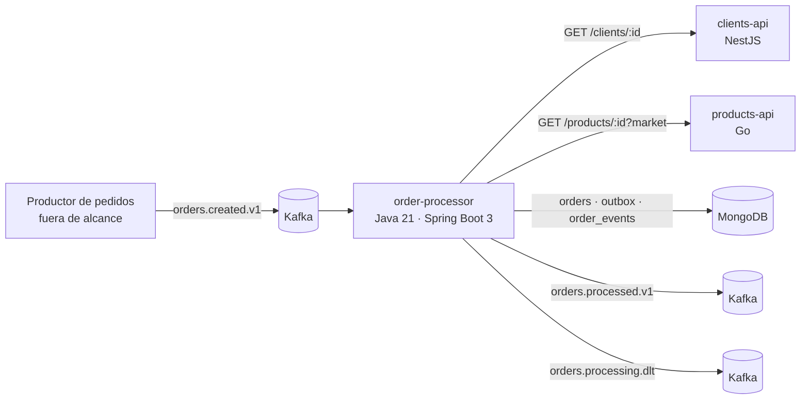
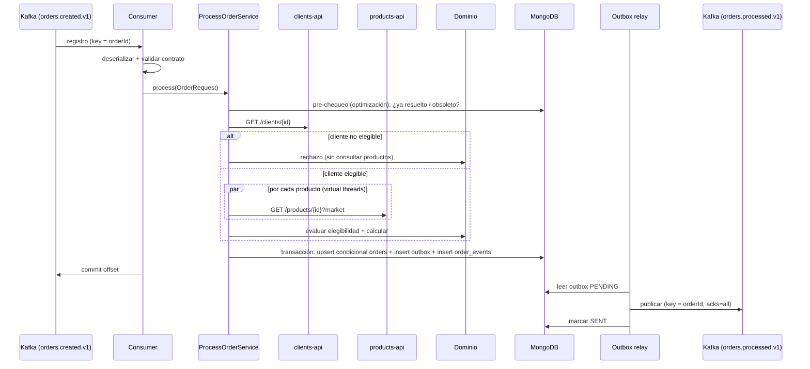

# PROPUESTA DE ARQUITECTURA - PLATAFORMA CONFIABLE DE PEDIDOS

| Campo | Valor |
| --- | --- |
| Estado | Propuesta inicial |
| Fecha | 2026-09-26 |
| Alcance | `order-processor` (Java), `products-api` (Go), `clients-api` (NestJS) |
| Documentos relacionados | `docs/adr/ADR-001-modelo-de-concurrencia.md`, `docs/adr/ADR-002-consistencia-persistencia-publicacion.md`, `docs/implementation-notes.md` |

> Este documento fija las decisiones antes de su implementación

---

## 1. Entendimiento del problema

Distribuidores de MX, CO y PE generan pedidos que llegan a Kafka (`orders.created.v1`). Un worker (`order-processor`) debe transformar cada evento en UN ÚNICO RESULTADO DE NEGOCIO (`APPROVED`, `REJECTED` o `TECHNICAL_FAILURE`), persistirlo en MongoDB y notificarlo en `orders.processed.v1`.

El cálculo en sí (impuestos, descuentos, redondeo) es sencillo. La dificultad real está en los bordes del sistema:

1. **Entrega al-menos-una-vez**: Kafka reentrega mensajes ante rebalanceos, reinicios o fallos antes del commit del offset.
2. **Concurrencia**: el mismo pedido puede llegar repetido, en versiones distintas o fuera de orden.
3. **Doble escritura**: persistir en MongoDB y publicar en Kafka son dos sistemas sin transacción común.
4. **Fallos parciales**: dos dependencias HTTP que pueden devolver 404, 429, 5xx o no responder.
5. **Contratos entre equipos**: tres servicios en tres stacks que deben evolucionar sin romperse entre sí.
El objetivo de diseño es: **cada evento válido produce como máximo un efecto de negocio, ningún resultado persistido queda sin notificar, y ninguna notificación existe sin su resultado persistido.**
 
---

## 2. Supuestos
 
Cada supuesto tiene un identificador para referenciarlo en código, tests. Los marcados con ❓ deberían validarse con el equipo dueño del contrato de entrada.
 
| ID | Supuesto | Consecuencia en el diseño |
|---|---|---|
| S1 ❓ | `eventVersion` representa la **revisión del pedido** (monótona creciente por `orderId`), no la versión del esquema. La versión del esquema la da el sufijo del tópico (`.v1`). | Es la única lectura compatible con el requisito "una versión menor después de una mayor no debe sobrescribir". Si fuera versión de esquema, el control de obsolescencia necesitaría otro campo (p. ej. `occurredAt` o una revisión explícita). |
| S2 | `eventId` es globalmente único (ULID generado por el productor). | Se usa como clave de idempotencia del evento. |
| S3 | `orderId` es globalmente único (incluye el mercado en su formato). | Es la clave del documento de resultado. |
| S4 | El productor publica con key = `orderId`. | Los eventos de un pedido caen en la misma partición y se procesan en orden. **No se confía solo en esto**: la corrección se garantiza en la escritura (sección 6). |
| S5 | `unitPrice` es el precio acordado con el distribuidor y es fuente de verdad. Products API no provee precios. | No se recalcula ni valida el precio contra el catálogo. |
| S6 | Una versión mayor de un pedido reemplaza el resultado vigente y genera un nuevo evento de salida. | Un pedido puede pasar de `APPROVED` a `REJECTED` entre versiones. Los consumidores se quedan con la última revisión. |
| S7 | `TECHNICAL_FAILURE` no se publica en `orders.processed.v1` (el contrato lo exige solo para aprobados y rechazados). Se persiste y se envía a `orders.processing.dlt`. | Los consumidores de negocio solo ven resultados definitivos. |
| S8 | Un `TECHNICAL_FAILURE` puede reprocesarse con el **mismo** `eventId` (replay desde la DLT). | La regla de duplicados distingue "ya tiene resultado definitivo" de "falló técnicamente". |
| S9 | Un 404 de `GET /products/{id}?market=X` significa "no existe o no se comercializa en ese mercado". | Ambos casos se tratan como `REJECTED` con `PRODUCT_NOT_FOUND`. |
| S10 | Todas las monedas se redondean a 2 decimales, incluida COP (aunque en la práctica se opere sin centavos). | Se sigue la regla del enunciado; se documenta como punto a revisar con negocio. |
| S11 | Volumen moderado: decenas de pedidos por segundo, hasta ~200 líneas por pedido. | Procesamiento síncrono por registro con paralelismo solo en las consultas de productos. Límite de líneas configurable. |
| S12 | MongoDB se despliega como replica set (en local, replica set de un nodo). | Se pueden usar transacciones multi-documento. |
| S13 | Los consumidores de `orders.processed.v1` toleran duplicados y deduplican por `eventId`. | Se garantiza al-menos-una-vez en la salida, no exactamente-una-vez. |
| S14 | Clientes y productos son datos de referencia de solo lectura para `order-processor`. | Reintentar una consulta nunca produce efectos laterales. |
| S15 | Las tasas de impuesto cambian con poca frecuencia y requieren validación de negocio. | Viven en el dominio como tabla versionada en código; cada línea persiste la tasa aplicada. |
 
---

## 3. Responsabilidades y límites de cada componente
 

 
| Componente | Responsabilidad | Es dueño de | No hace |
|---|---|---|---|
| `order-processor` | Validar el evento, enriquecerlo, aplicar reglas de negocio, persistir el resultado y notificarlo. | Colecciones `orders`, `outbox`, `order_events`. Contratos `orders.processed.v1` y `orders.processing.dlt`. Tabla de impuestos y reglas de descuento. | No modifica datos de clientes ni productos. No expone lógica a otros servicios (el `GET /orders/{id}` opcional es solo lectura). |
| `products-api` | Exponer el catálogo por mercado. | Datos de producto y contrato `GET /products/{productId}`. La **categoría fiscal** del producto. | No conoce tasas de impuesto, pedidos ni clientes. |
| `clients-api` | Exponer datos de clientes. | Datos de cliente y contrato `GET /clients/{clientId}`. Estado, segmento y régimen fiscal. | No conoce pedidos, productos ni reglas de descuento. |
| Productor de pedidos (externo) | Publicar pedidos. | Contrato `orders.created.v1`. | — |
 
**Dependencias permitidas**
 
- `order-processor` → `clients-api` y `products-api` (HTTP síncrono, solo lectura).
- `order-processor` → MongoDB y Kafka.
- Las APIs no se llaman entre sí ni llaman a `order-processor`.
- Ningún servicio accede a la base de datos de otro.
**Frontera conceptual clave**: la *categoría fiscal* pertenece al catálogo; la *tasa* pertenece al procesamiento de pedidos. Así, un cambio de tasa no obliga a desplegar `products-api`, y el catálogo no necesita saber de impuestos por mercado.
 
---

## 4. Capas, puertos y adaptadores (`order-processor`)
 
### 4.1 Estructura
 
```
com.b2b.orders
├── domain                      # Java puro: sin Spring, Kafka, Mongo ni DTOs externos
│   ├── model                   # Order, OrderLine, Client, Product, Market, Currency, Money, OrderStatus
│   ├── policy                  # EligibilityPolicy, TaxPolicy (tabla de tasas), DiscountPolicy
│   ├── service                 # OrderCalculator, OrderEvaluator
│   └── error                   # RejectionReason, InvalidOrderException
├── application
│   ├── port/in                 # ProcessOrderUseCase
│   ├── port/out                # ClientCatalog, ProductCatalog, OrderResultStore, DeadLetterSink, Clock, IdGenerator
│   └── service                 # ProcessOrderService (orquestación)
└── infrastructure
    ├── kafka                   # Consumidor, DTO OrderCreatedEventV1, mapper, publicador DLT
    ├── http                    # Clientes RestClient, DTOs de las APIs, mapeo de errores, resiliencia
    ├── mongo                   # Documentos, repositorio con escritura condicional, índices
    ├── outbox                  # Relay que publica orders.processed.v1
    ├── observability           # MDC, métricas
    └── config                  # Beans, propiedades externalizadas
```
 
**Regla de dependencia**: `infrastructure → application → domain`. Nunca al revés. Se verifica con un test de ArchUnit que falla el build si `domain` importa `org.springframework`, `org.apache.kafka`, `com.mongodb` o clases de `infrastructure`.
 
### 4.2 Modelos y mapeos explícitos
 
| Frontera | Modelo externo | Modelo interno | Mapper |
|---|---|---|---|
| Entrada Kafka | `OrderCreatedEventV1` (DTO JSON) | `OrderRequest` (comando validado) | `OrderEventMapper` |
| Clients API | `ClientResponseDto` | `Client` (dominio) | `ClientMapper` |
| Products API | `ProductResponseDto` | `Product` (dominio) | `ProductMapper` |
| Persistencia | `OrderDocument`, `OutboxDocument` | `ProcessedOrder` (dominio) | `OrderDocumentMapper` |
| Salida Kafka | `OrderProcessedEventV1` (DTO JSON) | `ProcessedOrder` | `OrderProcessedMapper` |
 
Los mappers de las APIs traducen valores desconocidos de enums (p. ej. un `status` nuevo) a un valor seguro del dominio (`UNKNOWN`), que la política de elegibilidad trata como **no elegible**. Esto implementa el *tolerant reader* sin aprobar pedidos con datos que no entendemos.
 
### 4.3 Validación en dos niveles
 
- **Sintáctica (adaptador Kafka)**: JSON bien formado, campos obligatorios, tipos. `quantity` debe ser entero JSON; los decimales se deserializan como `BigDecimal` (`USE_BIG_DECIMAL_FOR_FLOATS`) para no pasar nunca por `double`.
- **Semántica (dominio)**: al construir `OrderRequest` y sus value objects se verifican los invariantes: mercado soportado, moneda coherente con el mercado, `items` no vacío, `productId` sin repetir, `quantity > 0`, `unitPrice >= 0`.
Ambos niveles producen un **error de validación**: el mensaje va a la DLT y no se persiste como pedido procesado.
 
### 4.4 Puertos
 
```java
// Entrada
ProcessingOutcome process(OrderRequest request, EventMetadata metadata);
 
// Salida
ClientLookup     ClientCatalog.findById(ClientId id);                 // Found | NotFound, o lanza DependencyException
ProductLookup    ProductCatalog.findById(ProductId id, Market market);
StoreOutcome     OrderResultStore.store(ProcessedOrder result);       // SAVED | DUPLICATE | STALE | CONFLICT
void             DeadLetterSink.send(DeadLetter letter);
```
 
`DependencyException` tiene dos subtipos: `TransientDependencyException` y `DefinitiveDependencyException`. El caso de uso nunca ve códigos HTTP.
 
---
 
## 5. Flujo principal y flujos de error
 
### 5.1 Flujo principal
 

 
**Orden de evaluación determinista de elegibilidad** (la primera razón encontrada es la razón principal; el documento guarda la lista completa de las evaluadas):
 
1. `CLIENT_NOT_FOUND`
2. `CLIENT_NOT_ACTIVE` (incluye `BLOCKED` y estados desconocidos)
3. `CLIENT_MARKET_MISMATCH`
4. `PRODUCT_NOT_FOUND` (por producto)
5. `PRODUCT_NOT_ACTIVE` (incluye `DISCONTINUED` y estados desconocidos)
Si el cliente no es elegible, no se consultan productos: el resultado no puede ser `APPROVED` y se evitan llamadas innecesarias.
 
### 5.2 Clasificación de errores
 
| Categoría | Detección | ¿Reintenta? | Estado persistido | Evento de salida | DLT | Offset |
|---|---|---|---|---|---|---|
| `VALIDATION_ERROR` | Adaptador o dominio | No | Ninguno (solo `order_events` con resultado `INVALID`) | No | Sí | Commit tras enviar a la DLT |
| `BUSINESS_REJECTION` | Dominio | No | `REJECTED` + razón | Sí | No | Commit |
| `RESOURCE_NOT_FOUND` (404) | Adaptador HTTP | No | `REJECTED` (`CLIENT_NOT_FOUND` / `PRODUCT_NOT_FOUND`) | Sí | No | Commit |
| `TRANSIENT_DEPENDENCY` (429, 500, 502, 503, timeout, conexión rechazada) | Adaptador HTTP | Sí, en proceso | Si se agotan los intentos: `TECHNICAL_FAILURE` | No | Sí | Commit tras persistir |
| `DEFINITIVE_DEPENDENCY` (400, 401, 403, otros 4xx, respuesta que no respeta el contrato) | Adaptador HTTP | No | `TECHNICAL_FAILURE` | No | Sí | Commit tras persistir |
| `PERSISTENCE_ERROR` | Adaptador Mongo | Sí, a nivel de contenedor Kafka | — | — | Solo si se agota el presupuesto | **Sin commit** hasta resolver |
| `PUBLICATION_ERROR` | Relay de outbox | Sí, indefinidamente con backoff | Ya persistido | Pendiente en outbox | No (se alerta) | Ya confirmado |
| `DUPLICATE` / `STALE` / `CONFLICT` | Escritura condicional | No | Sin cambios | No | No (`CONFLICT` genera alerta) | Commit |
| `REPEATED_DELIVERY_FAILURE` (el proceso cae repetidamente con el mismo mensaje) | Contador en `delivery_attempts` (sección 5.6) | No (ya se reintentó `maxDeliveryAttempts` veces) | Ninguno | No | Sí, con los bytes originales | Commit tras enviar a la DLT |
 
Un 404 **no** es un error técnico: es información de negocio definitiva.
 
### 5.3 Política de reintentos HTTP
 
| Parámetro | Valor inicial | Motivo |
|---|---|---|
| Timeout de conexión | 500 ms | Servicios internos en la misma red. |
| Timeout de respuesta | 2 s | Las APIs responden desde memoria; más de 2 s indica degradación. |
| Intentos máximos | 3 (1 + 2 reintentos) | Absorbe fallos puntuales sin bloquear la partición demasiado. |
| Backoff | Exponencial: 200 ms, 400 ms, con jitter ±20 % | Evita reintentos sincronizados. |
| 429 | Respeta `Retry-After` con tope de 2 s; si excede el tope, cuenta como intento agotado | No saturar a un proveedor que pide calma. |
| Presupuesto total por pedido | 10 s | Acota el tiempo de bloqueo de la partición y queda muy por debajo de `max.poll.interval.ms`. |
| Paralelismo de productos | Hasta 8 consultas concurrentes por pedido | Reduce latencia sin castigar a `products-api`. |
 
Nunca se reintentan: 400, 401, 403, 404, otros 4xx distintos de 429, respuestas con cuerpo que no cumple el contrato y errores de validación del evento.
 
Se descarta reintentar dependencias mediante tópicos de reintento no bloqueantes, porque romperían el orden por `orderId` (ver sección 11).
 
### 5.4 Errores de persistencia
 
Si MongoDB no está disponible, enviar cada mensaje a la DLT convertiría una caída de infraestructura en miles de pedidos a reprocesar. Por eso se usa el `DefaultErrorHandler` de Spring Kafka con backoff exponencial (1 s → 60 s, tiempo máximo 10 min) **sin commit del offset**. La partición queda detenida a propósito: es backpressure natural. Solo al agotar el presupuesto el mensaje va a la DLT con categoría `PERSISTENCE_ERROR`.
 
### 5.5 Respuesta parcial e interrupción del proceso
 
**Respuesta parcial**: si alguna consulta de producto termina en error transitorio agotado, el pedido completo queda en `TECHNICAL_FAILURE`. Nunca se aprueba ni se calcula con información incompleta.
 
**Interrupción del proceso** (análisis por punto de corte):
 
| El proceso muere... | Qué ocurre al reiniciar | Resultado |
|---|---|---|
| antes de persistir | Kafka reentrega (sin commit). Las consultas son de solo lectura. | Se procesa normalmente. |
| después de persistir, antes del commit | Kafka reentrega. La escritura condicional detecta `DUPLICATE`. | Commit sin efecto nuevo. |
| después del commit, antes de publicar | El relay encuentra la entrada `PENDING` en el outbox. | Se publica. |
| después de publicar, antes de marcar `SENT` | El relay vuelve a publicar con el **mismo** `eventId` de salida. | Duplicado en la salida, deduplicable por el consumidor (S13). |
 
La primera fila es el caso más común (el evento llegó a Kafka, pero el worker cayó antes de guardar). No requiere un mecanismo de reintento propio: **el offset no confirmado es el reintento**. Kafka conserva el mensaje, y al reiniciar el worker (o cuando otra instancia recibe la partición en un rebalanceo) el consumer group retoma desde el último offset confirmado. La sección 5.6 cubre los casos en que esta reentrega por sí sola no basta.
 
### 5.6 Reentrega, mensajes veneno y apagado controlado
 
**Problema.** La reentrega de Kafka resuelve las caídas aisladas, pero tiene dos puntos ciegos:
 
1. **Mensaje veneno que tumba el proceso.** Si un mensaje provoca la caída del proceso (OOM por un payload desmedido, un error nativo, un bucle en la deserialización), nunca llega al manejador de errores y, por tanto, nunca va a la DLT. Kafka no cuenta reentregas: el worker reinicia, vuelve a leer el mismo offset y vuelve a caer, indefinidamente. La partición queda bloqueada y los demás pedidos de esa partición no avanzan.
2. **Un pedido "en vuelo" no deja rastro.** Si el worker cae antes de persistir, no queda evidencia de que el evento fue recibido, lo que dificulta la investigación (sección 13 del enunciado).
**Decisión: contador de entregas persistido antes de procesar.**
 
- Colección `delivery_attempts`, con `_id = "{topic}:{partition}:{offset}"`. La clave es el **offset** y no el `eventId` porque identifica exactamente la entrega que se repite en un bucle de caídas y funciona aunque el mensaje no pueda deserializarse.
- Al recibir un registro, **antes de deserializar o procesar**, el worker ejecuta una operación atómica:
```
  findOneAndUpdate(
    { _id: "orders.created.v1:2:18841" },
    { $inc: { attempts: 1 }, $set: { lastSeenAt: now, status: "IN_PROGRESS" },
      $setOnInsert: { firstSeenAt: now } },
    upsert: true, returnDocument: AFTER)
```
  Esta escritura queda **fuera** de la transacción de resultado, para que sobreviva a la caída.
- Si `attempts > maxDeliveryAttempts` (3 por defecto) y el estado sigue en `IN_PROGRESS`, el mensaje **no se procesa**: se envía a la DLT con los bytes originales y la categoría `REPEATED_DELIVERY_FAILURE`, se marca `DEAD_LETTERED` y se confirma el offset. La partición se desbloquea.
- Al terminar con éxito, el estado pasa a `DONE` antes del commit del offset. Cuando el camino incluye la transacción de resultado, esta actualización va dentro de la misma transacción.
- Si el mensaje se puede leer parcialmente, se guardan también `eventId` y `orderId` para facilitar la búsqueda.
- TTL de 7 días sobre `lastSeenAt`: es información operativa, no histórica.
**Condición necesaria:** el consumidor recibe el valor como `String` (o `byte[]`) y la deserialización ocurre en nuestro código, después de registrar el intento. Si Spring deserializara antes (`JsonDeserializer` directo), un payload que rompe la deserialización fallaría antes de ser contado. Además, se rechaza de inmediato cualquier payload que supere `max-payload-bytes` (256 KB por defecto) o `max-items` (S11).
 
**Costo aceptado:** una escritura adicional en MongoDB por mensaje. Con el volumen supuesto (S11) es irrelevante. Si MongoDB no está disponible en ese paso, aplica la misma política de la sección 5.4: backoff sin commit.
 
**Apagado controlado.** Ante un `SIGTERM` (despliegue, escalado), el worker:
 
1. deja de pedir registros nuevos (`poll`);
2. termina el registro en curso, respetando el presupuesto de 10 s de la sección 5.3;
3. confirma su offset y cierra el consumidor, lo que libera las particiones de inmediato en lugar de esperar al `session.timeout`;
4. detiene el relay del outbox al terminar el lote en curso; lo pendiente lo publicará la siguiente instancia.
Configuración: `spring.lifecycle.timeout-per-shutdown-phase=30s`, `shutdownTimeout` del contenedor de Kafka en 30 s y `stop_grace_period: 40s` en Docker Compose (mayor que el anterior, para que el orquestador no mate el proceso antes). El apagado controlado no es necesario para la corrección, porque la reentrega ya la garantiza, pero evita reprocesamientos y reintentos HTTP innecesarios en cada despliegue.
 
**Visibilidad de pedidos atascados.**
 
- Métrica `orders.delivery.stuck`: cantidad de registros en `IN_PROGRESS` con `lastSeenAt` de más de 5 minutos. Alerta si es mayor que 0.
- Métrica `orders.delivery.redelivered`: entregas con `attempts > 1`. Un aumento indica caídas o rebalanceos frecuentes.
- Lag del consumer group por partición: si una partición no avanza mientras las demás sí, hay un mensaje bloqueándola.
Con esto, la investigación de "el cliente dice que envió el pedido pero no aparece" tiene una ruta concreta: `order_events` y `orders` por `orderId` → `delivery_attempts` por `orderId` (¿llegó y quedó en vuelo?) → DLT por `orderId` → lag del consumer group → verificar en el tópico de entrada si el productor llegó a publicar.
 
---
 
## 6. Idempotencia y concurrencia
 
### 6.1 Modelo de datos
 
**`orders`**: un documento por pedido con el resultado vigente.
 
```json
{
  "_id": "ORD-MX-000147",
  "eventId": "01J8ZP6M5E4RH0K7Y2N9A3TQWX",
  "eventVersion": 1,
  "status": "APPROVED",
  "market": "MX",
  "currency": "MXN",
  "client": { "clientId": "CLI-99821", "segment": "WHOLESALE", "taxRegime": "GENERAL", "status": "ACTIVE", "market": "MX" },
  "lines": [
    {
      "productId": "PRD-001", "sku": "BEB-600-PET", "name": "Bebida 600 ml",
      "taxCategory": "STANDARD", "quantity": 24, "unitPrice": "35.50",
      "discountRate": "0.03", "taxRate": "0.16",
      "grossSubtotal": "852.00", "discount": "25.56", "netSubtotal": "826.44",
      "taxAmount": "132.23", "lineTotal": "958.67"
    }
  ],
  "totals": { "grossSubtotal": "...", "discount": "...", "netSubtotal": "...", "tax": "...", "grandTotal": "..." },
  "reason": null,
  "reasons": [],
  "error": null,
  "attempts": 1,
  "receivedAt": "2026-09-18T15:42:10.512Z",
  "processedAt": "2026-09-18T15:42:11.034Z",
  "trace": { "topic": "orders.created.v1", "partition": 2, "offset": 18841, "traceId": "..." },
  "schemaVersion": 1
}
```
 
Decisiones del esquema:
 
- `_id = orderId` convierte la unicidad del pedido en una restricción nativa, sin índice adicional.
- Los importes se guardan como `Decimal128` (en el JSON de ejemplo se muestran como texto): cero pérdida de precisión.
- Se persisten las tasas aplicadas y un *snapshot* del cliente y los productos: el resultado es auditable aunque cambien los datos de referencia.
- `schemaVersion` permite migraciones perezosas del documento sin romper lecturas.
**`order_events`**: registro inmutable de cada evento recibido (`_id = eventId`) con `orderId`, `eventVersion`, resultado (`PROCESSED`, `DUPLICATE`, `STALE`, `CONFLICT`, `INVALID`) y fechas. Sirve para trazabilidad e investigación, **no** como mecanismo de exclusión.
 
**`outbox`**: ver sección 7.
 
**`delivery_attempts`**: contador de entregas por `topic:partition:offset` para detectar mensajes veneno y pedidos atascados. Ver sección 5.6.
 
**Índices**: `orders._id` (implícito), `orders.eventId` (único), `orders.status + processedAt` (consultas operativas), `outbox.status + createdAt`, `outbox.sentAt` (TTL de 7 días), `order_events.orderId + eventVersion`, `delivery_attempts.status + lastSeenAt`, `delivery_attempts.orderId`, `delivery_attempts.lastSeenAt` (TTL de 7 días).
 
### 6.2 Escritura condicional atómica
 
El resultado se escribe con **una única operación atómica sobre un documento**, dentro de una transacción que también inserta en `outbox` y `order_events`:
 
```
filtro:  { _id: orderId,
           $or: [ { eventVersion: { $lt: v } },                          // versión más nueva
                  { eventId: e, status: "TECHNICAL_FAILURE" } ] }        // replay de un fallo técnico (S8)
acción:  reemplazar el documento
upsert:  true
```
 
- Si no existe documento para el pedido, el upsert lo inserta.
- Si existe y cumple el filtro, se reemplaza.
- Si existe y **no** cumple el filtro, el upsert intenta insertar con el mismo `_id` y MongoDB responde `DuplicateKey`. Se aborta la transacción y se lee el documento vigente para clasificar el caso.
Clasificación tras un `DuplicateKey`:
 
| Documento vigente | Clasificación | Acción |
|---|---|---|
| mismo `eventId`, estado definitivo | `DUPLICATE` | Ignorar y hacer commit |
| distinto `eventId`, misma `eventVersion` | `CONFLICT` | Ignorar, log `WARN`, métrica, alerta |
| `eventVersion` mayor | `STALE` | Ignorar y hacer commit |
 
### 6.3 Los tres casos exigidos
 
1. **Mismo `eventId` repetido** (secuencial o simultáneo): la primera escritura gana; las demás no cumplen el filtro y se clasifican como `DUPLICATE`. Un solo documento y una sola entrada en outbox.
2. **Dos eventos distintos con mismo `orderId` y `eventVersion`**: gana el primero en escribir; el segundo es `CONFLICT`. Es un error del productor, así que se alerta en lugar de elegir silenciosamente por contenido.
3. **Versión menor después de una mayor**: el filtro `eventVersion < v` no se cumple y el caso es `STALE`. El resultado más nuevo nunca se sobrescribe.
El **pre-chequeo** anterior a las llamadas HTTP (sección 5.1) es solo una optimización para no consultar las APIs en duplicados evidentes. La garantía está en la escritura condicional; por eso el patrón `exists` + `save` no aparece en ningún punto crítico.
 
### 6.4 Modelo de concurrencia y commit de offsets
 
Detalle y alternativas en **ADR-001**.
 
- Spring Boot 3 con **virtual threads** (`spring.threads.virtual.enabled=true`) y código bloqueante.
- Concurrencia del listener = número de particiones del tópico (3 en local). Cada hilo procesa sus registros **secuencialmente**, lo que preserva el orden por `orderId`.
- Paralelismo interno solo para consultas de productos de un mismo pedido.
- `enable.auto.commit=false`, `AckMode.RECORD`: el offset se confirma después de que el registro termina con éxito (persistido, clasificado como duplicado u obsoleto, o enviado a la DLT).
- Rebalanceos: un registro en vuelo puede procesarse en otra instancia. La escritura condicional lo absorbe.
- El valor del registro se consume como `String` y se deserializa en el adaptador, después de registrar el intento de entrega (sección 5.6).
- Apagado controlado: se termina el registro en curso y se confirma su offset antes de cerrar el consumidor (sección 5.6).
---
 
## 7. Consistencia entre MongoDB y Kafka
 
Detalle y alternativas en **ADR-002**.
 
**Decisión: transactional outbox con relay por polling.**
 
En la misma transacción de MongoDB se escriben:
 
1. el documento en `orders` (escritura condicional);
2. una entrada en `outbox` con el evento de salida ya serializado, `topic`, `key = orderId`, `eventId` de salida (ULID generado **una sola vez**), `status = PENDING` y `createdAt`;
3. el registro en `order_events`.
Un relay (`@Scheduled`, cada 500 ms) toma entradas `PENDING` en orden de `createdAt`, las reclama con `findOneAndUpdate` (lease `lockedUntil` para varias instancias), publica con productor idempotente (`acks=all`, `enable.idempotence=true`) y marca `SENT`.
 
Para `TECHNICAL_FAILURE`, la entrada de outbox apunta a `orders.processing.dlt` y conserva el mensaje original. Así, el mismo mecanismo garantiza que ningún fallo técnico persistido quede sin llegar a la DLT.
 
Los errores de validación no se persisten como pedido: se publican en la DLT de forma síncrona antes del commit. Si esa publicación falla, no hay commit y Kafka reentrega.
 
**Cómo se evitan los estados inconsistentes exigidos**
 
| Estado inconsistente | Por qué no ocurre |
|---|---|
| Pedido persistido sin evento de salida | El pedido y su entrada de outbox se escriben en la misma transacción. El relay reintenta hasta publicar. |
| Evento publicado sin pedido persistido | Solo se publica lo que existe en el outbox, que solo existe si la transacción confirmó. |
| Más de un efecto de negocio por pedido | La escritura condicional (sección 6) permite una sola escritura por `(orderId, eventVersion)`. Los duplicados de publicación comparten `eventId` y son deduplicables. |
 
**Garantía resultante**: exactamente-un-efecto en MongoDB y al-menos-una-vez en Kafka, con duplicados identificables.
 
**Orden de salida**: con varias instancias de relay podría alterarse el orden entre versiones de un mismo pedido. Para eso el evento de salida incluye `sourceEventVersion` (campo aditivo) y los consumidores conservan la versión mayor.
 
---
 
## 8. Compatibilidad y evolución de contratos
 
### 8.1 Ownership
 
| Contrato | Dueño (productor) | Consumidores | Ubicación |
|---|---|---|---|
| `orders.created.v1` | Equipo de captura de pedidos (externo) | `order-processor` | `contracts/events/orders.created.v1.schema.json` |
| `orders.processed.v1` | `order-processor` | Sistemas de negocio aguas abajo | `contracts/events/orders.processed.v1.schema.json` |
| `orders.processing.dlt` | `order-processor` | Operación / soporte | `contracts/events/orders.processing.dlt.md` |
| `GET /products/{productId}` | `products-api` | `order-processor` | `contracts/http/products-api.openapi.yaml` |
| `GET /clients/{clientId}` | `clients-api` | `order-processor` | `contracts/http/clients-api.openapi.yaml` |
| Cuerpo de error HTTP | Estándar compartido de plataforma | Todos | `contracts/http/error.schema.json` |
 
Cuerpo de error común:
 
```json
{ "code": "PRODUCT_NOT_FOUND", "message": "Product PRD-999 not found in market PE", "status": 404, "traceId": "4bf92f3577b34da6", "timestamp": "2026-09-18T15:42:10Z" }
```
 
### 8.2 Reglas de compatibilidad
 
**Cambios compatibles dentro de `v1`**:
- Agregar campos opcionales. Los consumidores ignoran campos desconocidos (*tolerant reader*).
- Agregar valores a un enum, siempre que el consumidor tenga un valor por defecto seguro. En `order-processor`, un estado desconocido equivale a "no elegible".
**Cambios incompatibles**: eliminar o renombrar campos, cambiar tipos o semántica, volver obligatorio un campo opcional, cambiar la unidad de un importe.
 
**Proceso para un cambio incompatible (expand–contract)**:
1. El productor publica `v2` (nuevo tópico `orders.created.v2` o ruta `/v2/...`) en paralelo a `v1`.
2. Los consumidores migran uno por uno, cada uno a su ritmo.
3. Se anuncia la fecha de retiro de `v1` y se monitorea que no queden consumidores (métricas por versión).
4. Se retira `v1`.
### 8.3 Validación en CI
 
- Todos los esquemas viven en `/contracts`, con `CODEOWNERS` que exige aprobación del equipo dueño de cada contrato.
- Cada productor valida en sus tests que su salida cumple el esquema (Go: respuesta del handler contra OpenAPI; NestJS: e2e contra OpenAPI; Java: evento de salida contra JSON Schema).
- Cada consumidor ejecuta sus tests con los *fixtures* de ejemplo de `/contracts`.
- Un paso de CI compara los esquemas contra `main` (`oasdiff` para OpenAPI y un diff de JSON Schema para eventos) y **falla ante cambios incompatibles** en una versión existente.
- Evolución prevista: contract tests dirigidos por consumidor (Pact) cuando haya más consumidores.
### 8.4 Qué no debe filtrarse
 
- `products-api` no expone costos, proveedores, identificadores internos de base de datos ni tasas de impuesto.
- `clients-api` no expone datos de contacto, límites de crédito ni información fiscal que `order-processor` no necesita (RUC, RFC, NIT).
- `order-processor` no propaga DTOs de las APIs a su dominio ni a su evento de salida: publica su propio contrato.
- La DLT no incluye datos personales ni secretos; conserva el mensaje original, que ya circula por el tópico de entrada.
---
 
## 9. Riesgos y posibles regresiones
 
| # | Riesgo | Impacto | Mitigación |
|---|---|---|---|
| R1 | Interpretación errónea de `eventVersion` (S1) | Alto: toda la lógica de obsolescencia depende de ello | Validarlo con el dueño del contrato; la lógica está aislada en la escritura condicional y es fácil de cambiar. |
| R2 | MongoDB sin replica set en algún entorno | Alto: sin transacciones no hay outbox atómico | Replica set también en local y en Testcontainers; el arranque falla rápido si no se detecta. |
| R3 | Reintentos largos bloquean la partición | Medio: lag creciente | Presupuesto de 10 s por pedido, métricas de lag y alerta. |
| R4 | Aritmética con `double` en la deserialización | Alto: centavos incorrectos | `USE_BIG_DECIMAL_FOR_FLOATS`, `Decimal128` en Mongo, tests con valores límite de redondeo. |
| R5 | Relay de outbox detenido | Medio: resultados persistidos sin notificar | Métrica de antigüedad de la entrada `PENDING` más vieja con alerta, y relay idempotente. |
| R6 | Tormenta de 429 amplificada por reintentos | Medio | Jitter, `Retry-After` y presupuesto acotado; *circuit breaker* como siguiente paso. |
| R7 | Partición caliente (un distribuidor enorme) | Bajo | Monitorear lag por partición; la key por `orderId` distribuye bien. |
| R8 | Cambio de tasas de impuesto | Medio | Tabla versionada en código con tests *golden*; la tasa aplicada queda persistida por línea. |
| R9 | Ambigüedad del 404 de productos (S9) | Bajo | Tratado como rechazo definitivo; documentado en el contrato. |
| R10 | Crecimiento de `outbox` y `order_events` | Bajo | TTL sobre `sentAt` en outbox; política de retención para `order_events`. |
| R11 | Mensaje veneno que tumba el proceso y bloquea la partición en un bucle de reinicios | Alto: todos los pedidos de esa partición se detienen | Contador de entregas persistido antes de procesar, DLT tras `maxDeliveryAttempts`, límites de tamaño y deserialización propia (sección 5.6). |
| R12 | Apagado abrupto en cada despliegue | Bajo: reprocesamientos y llamadas HTTP extra, sin afectar la corrección | Apagado controlado con `stop_grace_period` mayor que el timeout de la aplicación (sección 5.6). |
| R13 | El contador de entregas cuenta de más (p. ej. un rebalanceo lento, no una caída real) y envía a la DLT un mensaje válido | Bajo | Umbral de 3 intentos, alerta sobre `REPEATED_DELIVERY_FAILURE` y replay desde la DLT sin pérdida del mensaje original. |
 
**Regresiones a vigilar con tests dedicados**: cambios en el orden de cálculo o el redondeo (tests *golden* con los valores del enunciado), cambios en la clasificación de errores HTTP (tests del adaptador con WireMock) y cambios en esquemas (diff en CI).
 
---
 
## 10. Estrategia de pruebas
 
| Nivel | Qué se prueba | Herramientas |
|---|---|---|
| Unitarias de dominio | Impuestos por mercado y categoría, exención por régimen, descuento con 19/20/21 unidades, redondeo `HALF_UP` en bordes (x.xx5), suma de líneas redondeadas, elegibilidad y su orden, validaciones e invariantes. | JUnit 5, tests parametrizados, AssertJ |
| Unitarias de aplicación | Orquestación con *fakes* de los puertos: cliente no elegible sin consultar productos, fallo transitorio → `TECHNICAL_FAILURE`, clasificación de resultados. | JUnit 5, fakes en memoria |
| Arquitectura | El dominio no depende de frameworks ni de infraestructura. | ArchUnit |
| Adaptador HTTP | Mapeo 404/429/5xx/timeout, reintentos, `Retry-After`, respuesta fuera de contrato. | WireMock (con escenarios) |
| Adaptador Mongo | Escritura condicional: `SAVED`, `DUPLICATE`, `STALE`, `CONFLICT` y replay de `TECHNICAL_FAILURE`. | Testcontainers MongoDB (replica set) |
| Concurrencia | N hilos escriben simultáneamente el mismo `eventId` → 1 documento y 1 outbox. Dos `eventId` con la misma versión → 1 gana, 1 `CONFLICT`. | Testcontainers, `ExecutorService` + `CountDownLatch` |
| Integración de extremo a extremo | Flujo feliz; duplicado; versión obsoleta; 503 recuperable → `APPROVED`; 503 permanente → `TECHNICAL_FAILURE` + DLT; evento inválido → DLT y nada en `orders`. | Testcontainers Kafka + MongoDB + WireMock, Awaitility |
| Caída y reentrega | Se detiene el consumidor después de leer y antes de persistir (hook de test en el caso de uso); al reiniciar, el pedido se procesa una sola vez. Un mensaje que falla `maxDeliveryAttempts` veces termina en la DLT con `REPEATED_DELIVERY_FAILURE` y los mensajes siguientes de la partición avanzan. | Testcontainers Kafka + MongoDB, Awaitility |
| products-api (Go) | Servicio y repositorio (table-driven), handler con `httptest`, cancelación de contexto. | `testing`, `httptest` |
| clients-api (NestJS) | Service y repositorio, endpoint e2e, formato de error. | Jest, Supertest |
| Contratos | Salidas contra JSON Schema / OpenAPI; diff de esquemas en CI. | Validadores por stack, `oasdiff` |
 
**Caso *golden***: el evento de ejemplo del enunciado, con cliente `WHOLESALE` / `GENERAL` en MX y ambos productos `STANDARD`, debe producir exactamente: `grossSubtotal 1836.00`, `discount 25.56`, `netSubtotal 1810.44`, `tax 289.67` y `grandTotal 2100.11`.
 
**Simulación de fallos**: WireMock en los tests de Java. En las APIs reales, inyección de fallos activable por configuración (`FAULT_INJECTION_ENABLED=true`) mediante el header `X-Fault: 429|500|503|timeout` o identificadores semilla reservados, lo que permite reproducir fallos manualmente con Docker Compose. Deshabilitada por defecto.
 
---
 
## 11. Decisiones descartadas
 
| Alternativa | Motivo del descarte | Se revisaría si... |
|---|---|---|
| WebFlux / programación reactiva | Mayor complejidad cognitiva y de depuración; con virtual threads el código bloqueante escala igual para este volumen. | El worker tuviera que manejar miles de llamadas concurrentes por instancia. |
| `exists` + `save` | No es atómico: dos hilos pueden ver "no existe" a la vez. | Nunca, como garantía. |
| Publicar y luego persistir / persistir y luego publicar sin outbox | Cualquier caída entre ambos pasos deja un estado inconsistente. | — |
| Transacciones de Kafka (exactly-once) | Solo cubren Kafka → Kafka; MongoDB queda fuera. | El resultado dejara de persistirse en MongoDB. |
| Relay con Change Streams | Menor latencia, pero más acoplamiento operativo (resume tokens) y más complejidad para una primera versión. | La latencia del polling fuera un problema medido. |
| Redis para deduplicación o locks | Infraestructura extra; las restricciones de MongoDB ya dan la garantía. | Hubiera que deduplicar antes de llegar a MongoDB por costo. |
| Lock distribuido por `orderId` | El particionado más la escritura condicional ya resuelven la exclusión; un lock añade expiraciones y bloqueos. | — |
| Tópicos de reintento no bloqueantes | Rompen el orden por `orderId`: la versión 2 podría procesarse antes que la 1 en reintento. | El orden dejara de importar o se tolerara vía `STALE`. |
| Schema Registry + Avro | Más infraestructura para esta etapa; JSON Schema versionado en el repo cubre la validación. | Crezca el número de productores y consumidores. |
| Caché de productos | Riesgo de aprobar un producto recién discontinuado; no hay problema de latencia medido. | Métricas muestren latencia o carga relevantes en `products-api`. |
| Librería compartida entre los tres servicios | Acopla despliegues de tres stacks distintos. Se comparten **contratos y convenciones**, no código. | — |
| Framework web en Go (gin, echo) | Desde Go 1.22, `net/http` soporta métodos y parámetros en rutas; no se necesita más. | Se requirieran middlewares complejos que la librería estándar no cubra razonablemente. |
| Base de datos en las APIs | Fuera de alcance; el repositorio detrás de una interfaz permite reemplazarlo sin tocar handlers ni consumidores. | — |
 
---
 
## 12. Plan de implementación incremental
 
Cada paso termina en un commit que compila y cuyos tests pasan.
 
| Paso | Entregable | Criterio de terminado |
|---|---|---|
| 0 | Este documento, ADR-001, ADR-002 y esquemas en `/contracts` | Commit previo a cualquier código |
| 1 | `docker-compose.yml`: Kafka (KRaft), creación de tópicos, MongoDB replica set, script de índices | `docker compose up` levanta todo sano |
| 2 | `products-api` con datos semilla, errores, healthcheck, apagado controlado y tests | `go test ./...` en verde; contrato validado |
| 3 | `clients-api` con datos semilla, validación, filtro de errores, healthcheck y tests | `npm test` y e2e en verde |
| 4 | Dominio de `order-processor` con tests unitarios y caso *golden* | Tests de dominio en verde; ArchUnit en verde |
| 5 | Caso de uso y puertos con *fakes* | Orquestación probada sin infraestructura |
| 6 | Adaptadores HTTP con timeouts, reintentos y mapeo de errores | Tests con WireMock en verde |
| 7 | Persistencia: escritura condicional, transacción y outbox | Tests de concurrencia con Testcontainers en verde |
| 8 | Consumidor Kafka (con contador de entregas y apagado controlado), relay del outbox y publicación a la DLT | Flujo de extremo a extremo funcionando en local; un mensaje veneno no bloquea la partición |
| 9 | Tests de integración de fallos, duplicados y versiones | Todos los escenarios de la sección 10 en verde |
| 10 | Observabilidad: logs JSON con MDC y métricas Micrometer | Transiciones visibles por `orderId` / `eventId` |
| 11 | README, `implementation-notes.md`, `technical-leadership.md` | Documentación completa |
| 12 | Opcionales (en este orden): métricas vía Actuator, `GET /orders/{id}`, caché de productos, Flutter | Solo con lo obligatorio terminado |
 
Los pasos 2 y 3 son independientes del 4 y 5; en un equipo se harían en paralelo desde el día 1, porque los contratos del paso 0 ya están acordados.
 
**Línea de corte si el tiempo no alcanza**: los pasos 0 a 9 son el mínimo defendible. Si algo queda fuera, la prioridad es mantener la corrección (dominio, idempotencia, outbox y sus tests) y recortar observabilidad y opcionales, documentándolo en `implementation-notes.md`.
 
