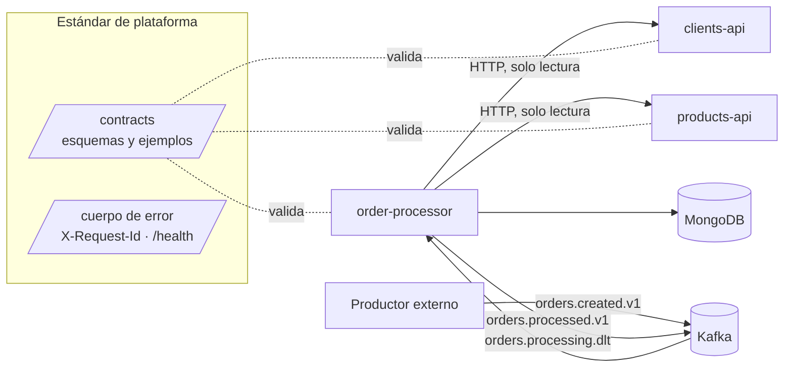

# Arquitectura de la plataforma

Complementa la sección 3 y la sección 8 de [`architecture-proposal.md`](architecture-proposal.md) con la vista de plataforma que quedó después de implementar: límites, fallos entre componentes y qué decisiones son comunes a los tres equipos y cuáles no.

## Componentes y límites

| Componente | Es dueño de | Puede depender de | No puede |
|---|---|---|---|
| order-processor | Reglas de negocio (tasas, descuento, elegibilidad), colecciones `orders`, `outbox`, `order_events`, `delivery_attempts`, contratos `orders.processed.v1` y DLT | clients-api, products-api, MongoDB, Kafka | Escribir datos de clientes o productos; exponer sus colecciones a otros servicios |
| products-api | Catálogo por mercado y categoría fiscal; contrato `GET /products/{id}` | Su propio almacenamiento | Conocer tasas, pedidos o clientes; llamar a otros servicios |
| clients-api | Estado, segmento y régimen fiscal del cliente; contrato `GET /clients/{id}` | Su propio almacenamiento | Conocer pedidos, productos o descuentos; llamar a otros servicios |

Las dependencias van en una sola dirección: order-processor consulta a las APIs, nunca al revés, y ningún servicio lee la base de datos de otro. Así cada API se despliega sin coordinarse con las demás mientras respete su contrato.

## Fallos entre componentes

| Falla | Qué ve order-processor | Qué pasa con el pedido | Qué no pasa |
|---|---|---|---|
| clients-api o products-api lentas o caídas (429, 5xx, timeout) | Error transitorio | Hasta 3 intentos; agotados → `TECHNICAL_FAILURE` + DLT. El pedido puede reprocesarse republicando el mismo evento | La partición no se bloquea por una API caída |
| Una API responde 404 | Recurso inexistente | Rechazo de negocio explícito (`CLIENT_NOT_FOUND`, `PRODUCT_NOT_FOUND`) | No se reintenta |
| Una API responde fuera de contrato (4xx inesperado, cuerpo inválido) | Error definitivo | `TECHNICAL_FAILURE` + DLT sin reintentos | No se adivinan valores |
| Una API agrega un valor de enum nuevo | Valor `UNKNOWN` | Se trata como no elegible (nunca como `ACTIVE`) | El servicio no falla |
| MongoDB caído | Error de persistencia | El offset no se confirma; reintento con backoff hasta 10 min; después, DLT `PERSISTENCE_ERROR` | No se publica ningún resultado sin persistir |
| Kafka caído al publicar | Error del relay | El resultado ya está en `outbox`; se publica cuando Kafka vuelve | No se pierde ni se publica un evento sin pedido |
| order-processor se cae a mitad de un mensaje | — | Kafka reentrega; la escritura condicional evita el doble efecto; tras 3 caídas con el mismo mensaje, DLT | No se procesa dos veces |

Los tiempos están acotados para que una dependencia lenta no se acumule: timeout de conexión 500 ms, de lectura 2 s, 3 intentos, `Retry-After` hasta 2 s. En el peor caso, con ambas APIs agotando sus intentos por timeout, un pedido tarda unos 14 s (cliente y luego productos, cada uno 3 × 2 s más backoff). Con 10 registros por *poll* son unos 140 s, por debajo de `max.poll.interval.ms` (5 min).

## Estrategia de compatibilidad

- Cada contrato tiene un único dueño (tabla en la propuesta §8.1) y vive en `/contracts`, con `CODEOWNERS` que exige su aprobación.
- Dentro de `v1` solo se permiten cambios aditivos. Los consumidores son *tolerant readers*: ignoran campos desconocidos y tienen un valor seguro para enums desconocidos.
- Un cambio incompatible es una versión nueva (`orders.created.v2`, `/v2/...`) publicada en paralelo; la anterior se retira cuando ya no tiene consumidores.
- Los ejemplos de `/contracts` son los datos de prueba de los tres servicios: si un productor cambia un ejemplo y rompe a un consumidor, lo detecta el CI del consumidor.

## Estándar compartido y decisiones de cada equipo

El criterio: se estandariza lo que **cruza un límite** entre servicios o lo que **necesita operación para diagnosticar**. Lo que queda dentro de un servicio lo decide su equipo.

| Estándar de plataforma (obligatorio) | Motivo |
|---|---|
| Contratos en `/contracts`, versionado y reglas de compatibilidad | Es lo único que dos equipos comparten |
| Cuerpo de error `{code, message, status, traceId, timestamp}` | order-processor clasifica errores sin conocer cada API |
| Semántica de códigos HTTP: 404 inexistente, 429 y 5xx transitorios, resto de 4xx definitivos | Decide qué se reintenta en toda la plataforma |
| Propagación de `X-Request-Id` (y `traceparent`) | Un pedido se sigue en los tres servicios con un solo identificador |
| Logs JSON con `traceId`, y `orderId`/`eventId` cuando existan | Búsqueda uniforme en producción |
| `GET /health` (o `/actuator/health`) y apagado controlado ante SIGTERM | Orquestación y despliegues sin cortar solicitudes |
| Configuración por variables de entorno, sin secretos en el repositorio | Mismo mecanismo en local, CI y producción |
| Controles mínimos de CI (compilar, tests, validar contratos) | Ningún cambio llega a `main` sin la misma barra |

| Decisión de cada equipo | Ejemplos actuales |
|---|---|
| Framework y librerías internas | Go con librería estándar; NestJS con class-validator; Spring con RestClient y driver de MongoDB |
| Estructura interna y patrones | Puertos y adaptadores completos en order-processor; handler + interfaz de catálogo en products-api |
| Almacenamiento propio | Hoy en memoria; mañana la base que convenga a cada API, sin cambiar el contrato |
| Herramientas de test | JUnit/Testcontainers, `go test`, Jest |
| Modelo de concurrencia | Virtual threads en Java, goroutines por solicitud en Go, event loop en Node |

## Cómo evitar replicar abstracciones

Las tres aplicaciones comparten convenciones, no código. No existe una librería común de "cliente HTTP con reintentos" ni un "modelo de error" compartido entre Java, Go y TypeScript:

- **Lo compartido es el contrato, no su implementación.** El cuerpo de error es un JSON Schema; cada servicio lo produce con lo idiomático de su stack. Una librería multi-lenguaje obligaría a mantener tres versiones sincronizadas.
- **Cada servicio tiene solo las capas que necesita.** products-api no tiene capa de servicio porque no tiene reglas (D5 en las notas); order-processor sí tiene puertos porque ahí están las reglas y la consistencia. Copiar la estructura de order-processor en las APIs agregaría interfaces sin un problema que resolver.
- **Las reglas de negocio viven en un solo lugar.** Tasas, descuentos y elegibilidad están solo en order-processor; las APIs entregan datos (categoría fiscal, régimen, estado), no decisiones.
- **Se extrae una librería compartida solo con evidencia.** Si un segundo consumidor Java necesita el mismo parser de `orders.created.v1`, se extrae; antes de eso, duplicar 200 líneas cuesta menos que acoplar despliegues.
