# Conducción técnica con un equipo de cuatro personas

Plan para construir la primera versión productiva con cuatro personas, avanzando en paralelo sin perder coherencia. Supone un equipo con experiencia mixta: una persona fuerte en Java, una en Go, una en TypeScript y yo como Tech Lead, también programando.

## 1. División inicial del trabajo y ownership

Cada persona es dueña de un componente **y** de un escenario de extremo a extremo. El componente evita pisarse; el escenario evita que nadie mire el sistema completo ("mi parte funciona").

| Persona | Componente | Escenario de extremo a extremo | Por qué |
|---|---|---|---|
| **A — Tech Lead** | order-processor: dominio, caso de uso y persistencia (escritura condicional, outbox) | Duplicados y concurrencia | Es donde un error cuesta dinero y es difícil de detectar después |
| **B — Java** | order-processor: consumidor Kafka, clientes HTTP, DLT | Fallos de dependencias (429, 5xx, timeouts, DLT) | Los adaptadores y sus fallos son una misma pieza |
| **C — Go** | products-api y el pipeline de CI | Contratos y compatibilidad | Quien produce un contrato cuida que no se rompa |
| **D — TypeScript** | clients-api, Docker Compose y scripts | Operación: observabilidad, runbook, prueba manual completa | El entorno local es la primera "producción" que usa todo el equipo |

Reglas:
- Un componente tiene un dueño, pero cualquiera puede cambiarlo con revisión del dueño.
- El dueño de un escenario escribe su test de integración y lo mantiene verde aunque la falla esté en código de otro.
- Yo reviso todo lo que toca consistencia (escritura condicional, outbox, offsets) aunque no sea mi componente.

## 2. Dependencias y orden de integración

```mermaid
gantt
    dateFormat X
    axisFormat Día %s
    section Todos
    Contratos y ejemplos acordados      :c, 0, 1
    section A
    Dominio y reglas                    :a1, 1, 3
    Persistencia y outbox               :a2, 3, 5
    section B
    Parser del evento y validación      :b1, 1, 2
    Clientes HTTP contra stubs          :b2, 2, 4
    Consumidor Kafka y DLT              :b3, 4, 5
    section C
    products-api                        :p, 1, 3
    CI                                  :ci, 3, 4
    section D
    Compose, tópicos, índices           :d1, 1, 2
    clients-api                         :d2, 2, 4
    section Integración
    Flujo completo en Compose           :i, 5, 6
```

1. **Día 0: contratos.** Nadie empieza a programar la integración sin los esquemas, los ejemplos y el cuerpo de error acordados.
2. **Trabajo en paralelo contra contratos, no contra servicios.** order-processor prueba sus clientes HTTP contra un servidor falso que devuelve los ejemplos de `/contracts`; las APIs prueban sus respuestas contra el OpenAPI. Nadie espera a que el otro termine.
3. **El dominio no espera a nadie.** Las reglas de negocio no dependen de Kafka, HTTP ni MongoDB.
4. **Integración temprana e incremental:** la primera integración real es un solo pedido *golden* de punta a punta en Compose, aunque falten casos de error. Después se agrega un escenario a la vez.

## 3. Contratos que acordaría antes de programar

| Contrato | Qué se fija | Dueño |
|---|---|---|
| `orders.created.v1` | Campos, tipos, obligatoriedad, **semántica de `eventVersion`** y clave del mensaje | Productor externo (se valida con él) |
| `orders.processed.v1` | Resultado, totales, razones de rechazo, `totals: null` en rechazos | order-processor |
| Headers de `orders.processing.dlt` | Metadatos obligatorios y qué datos nunca se incluyen | order-processor |
| `GET /products/{id}?market`, `GET /clients/{id}` | Respuesta, valores de enum y códigos de error | Cada API |
| Cuerpo de error y semántica de códigos HTTP | Qué es reintentable y qué es definitivo | Plataforma (todo el equipo) |
| Ejemplos de cada contrato | Casos válidos, inválidos por esquema e inválidos por negocio | El dueño del contrato |
| Nombres de campos de log y métricas | `orderId`, `eventId`, `traceId`; prefijos de métricas | Plataforma |

Los ejemplos son tan importantes como los esquemas: son los datos de prueba compartidos y la forma más rápida de detectar que dos personas entendieron distinto un campo.

## 4. Branches, pull requests y code review

- **Trunk-based** con ramas cortas (menos de 2 días) sobre `main`, que siempre compila y pasa tests.
- **PRs pequeños** (idealmente menos de 400 líneas). Un PR grande se divide o se revisa en pareja.
- **Aprobaciones:** 1 revisión en general; 2, una del dueño, si toca `/contracts`, la escritura condicional, el outbox, la política de offsets o un ADR (se refuerza con `CODEOWNERS`).
- **Commits:** Conventional Commits; *squash merge* con un mensaje que explique el porqué.
- **Qué se revisa, en este orden:** (1) corrección ante duplicados, concurrencia y fallos parciales; (2) contrato y compatibilidad; (3) tests que demuestran el comportamiento, no solo el camino feliz; (4) legibilidad. El estilo lo resuelven las herramientas, no la revisión.
- **Feedback basado en riesgo:** cada comentario indica si bloquea o es sugerencia, y por qué ("con dos consumidores esto puede guardar dos veces", no "yo lo haría distinto").

## 5. Controles mínimos de CI

Implementados en `.github/workflows/ci.yml`, cada uno obligatorio para hacer merge:

| Control | Componente |
|---|---|
| Compilación y tests unitarios | Los tres servicios |
| Tests de integración con Testcontainers (Kafka y MongoDB reales) | order-processor |
| `go vet`, `tsc --noEmit` | products-api, clients-api |
| Validación de esquemas y ejemplos de `/contracts` | contracts |
| Construcción de las imágenes Docker | Los tres servicios |

Siguientes controles, en orden: detección de cambios incompatibles en los contratos (`oasdiff` y diff de JSON Schema contra `main`), análisis de dependencias vulnerables y contract tests dirigidos por consumidor.

## 6. Criterios para aprobar o rechazar una decisión técnica

Una propuesta se aprueba si responde, con evidencia, a estas preguntas:

1. **¿Qué problema concreto resuelve?** Sin problema observable no hay abstracción, dependencia ni patrón nuevo.
2. **¿Qué alternativas se consideraron** y por qué se descartan?
3. **¿Es reversible?** Una decisión fácil de revertir (una librería interna) se toma rápido y la toma el equipo del componente. Una difícil de revertir (un contrato, el modelo de datos, la estrategia de consistencia) requiere un ADR y mi aprobación.
4. **¿Cómo se prueba?** Si no se puede escribir un test que la demuestre, no está lista.
5. **¿Qué cuesta operarla?** Un componente nuevo de infraestructura (Redis, schema registry) se justifica con un problema que el diseño actual no resuelve.
6. **¿Afecta a otros equipos?** Si cruza un límite, es estándar de plataforma y se decide en conjunto.

Se rechaza, con explicación, lo que agrega complejidad "por si acaso" o lo que se justifica solo por preferencia.

## 7. Plan de entrega incremental y rollback

| Fase | Qué se habilita | Criterio para avanzar |
|---|---|---|
| 0. Infraestructura | Tópicos, índices, dashboards y alertas **antes** del código | Alertas probadas con fallos inyectados |
| 1. Sombra | order-processor consume con otro *consumer group* y escribe en una base separada, sin publicar | Una semana de resultados comparados con el cálculo actual, sin diferencias en totales |
| 2. Un mercado | Publicación real solo para PE (el de menor volumen) | Tasa de `TECHNICAL_FAILURE` < 0,5 %, lag estable, cero `PERSISTENCE_ERROR` |
| 3. Todos los mercados | MX y CO | Mismos criterios durante una semana |

Las fases 1 y 2 requieren dos configuraciones que hoy no existen (desactivar la publicación y filtrar por mercado); se agregarían antes de salir a producción.

**Rollback:**
- **De código:** se vuelve a desplegar la imagen anterior. Es seguro porque los contratos solo cambian de forma aditiva, los documentos llevan `schemaVersion` y el procesamiento es idempotente: reprocesar mensajes no duplica efectos.
- **Lo que no se revierte con un deploy:** un cambio incompatible de contrato o de modelo de datos. Por eso esos cambios siguen *expand–contract*: primero se agrega lo nuevo, se migra y solo después se retira lo viejo.
- **Reprocesar un periodo:** se puede reiniciar el offset del consumidor a una fecha; la escritura condicional descarta lo ya procesado.

## 8. Principales riesgos técnicos y responsables

| Riesgo | Impacto | Mitigación | Responsable |
|---|---|---|---|
| Doble efecto por duplicados o concurrencia | Pedidos cobrados dos veces | Escritura condicional con restricción única; tests con N hilos | A |
| Pedido persistido sin evento o evento sin pedido | Sistemas desincronizados | Outbox transaccional; alerta sobre antigüedad del outbox | A |
| Semántica de `eventVersion` distinta a la supuesta | Revisiones descartadas por error | Validar el supuesto S1 con el dueño del contrato antes de la fase 1 | A |
| Dependencia lenta o caída | Lag y `TECHNICAL_FAILURE` | Timeouts, reintentos acotados, DLT reprocesable | B |
| Mensaje veneno que bloquea una partición | Pedidos detenidos | Contador de caídas y DLT tras 3 | B |
| Cambio incompatible de un contrato | Rechazos masivos o fallos | Reglas de compatibilidad, `CODEOWNERS`, validación en CI | C |
| Diferencias de cálculo (redondeo, tasas) | Montos incorrectos | Tests *golden* con valores calculados a mano; fase de sombra | A |
| Falta de visibilidad en producción | Incidentes largos | Logs correlacionados, métricas, runbook probado antes de salir | D |

## 9. Cómo manejaría un desacuerdo técnico entre dos integrantes

1. **Separar el problema de las soluciones.** Primero se acuerda qué se quiere resolver y cómo se medirá; muchos desacuerdos son sobre supuestos distintos.
2. **Cada propuesta por escrito, en media página:** qué resuelve, costo, riesgo, cómo se revierte.
3. **Evidencia antes que opinión.** Si la diferencia es medible, un *spike* con límite de tiempo (medio día): un test, un benchmark o un prototipo.
4. **Decidir con los criterios de la sección 6.** Si sigue empatado y la decisión es reversible, decide el dueño del componente; si no es reversible, decido yo y lo registro en un ADR con la opción descartada y **cuándo revisarla**.
5. **Acuerdo explícito de "no estoy de acuerdo, pero me comprometo".** Nadie implementa a medias una decisión que no comparte; la condición de revisión del ADR es la vía para reabrirla con datos.

La discusión es sobre la decisión, nunca sobre la persona, y en privado si hay tensión.

## 10. Definición de terminado de la primera versión productiva

**Funcional**
- [ ] Las reglas de validación, elegibilidad, impuestos, descuentos y redondeo tienen tests, incluidos los valores del enunciado calculados a mano.
- [ ] Los tres casos de idempotencia (mismo `eventId`, misma versión con otro evento, versión menor tardía) tienen tests de integración en verde.
- [ ] Cada tipo de error termina en el estado documentado (aprobado, rechazado, `TECHNICAL_FAILURE`, DLT).

**Confiabilidad**
- [ ] Probado a mano: caída de MongoDB, caída de Kafka, API caída y reinicio del worker a mitad de un lote, sin pérdidas ni duplicados.
- [ ] Apagado controlado verificado (SIGTERM no deja mensajes a medias).

**Operación**
- [ ] Dashboards y alertas de la sección de runbook activos y probados.
- [ ] Runbook ejecutado al menos una vez por alguien que no escribió el código.
- [ ] Procedimiento de reproceso desde la DLT documentado y probado.

**Proceso**
- [ ] CI obligatorio en verde; contratos con dueño en `CODEOWNERS`.
- [ ] Supuesto S1 (`eventVersion`) validado con el dueño del contrato de entrada.
- [ ] Deuda técnica conocida registrada en `implementation-notes.md` con dueño y prioridad.
- [ ] Fase de sombra completada sin diferencias.
